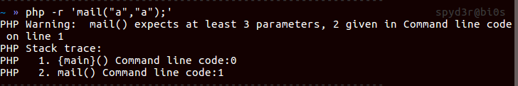
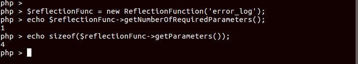
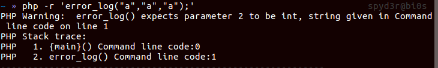
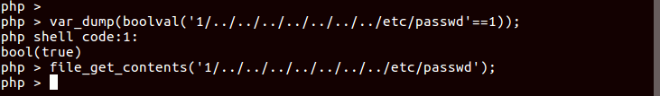

**This Fuzzer gets me new functions to bypass PHP disable_functions**

Me and one of my teammate [@\_\_c3rb3ru5__](https://twitter.com/__c3rb3ru5__) made `lazyFuzzer` to fuzz the all PHP functions to check if they call `execve` system call internally.

I also made a tool on the top of the findings this fuzzer did, here,  
**Announcing** [dfunc-bypasser](https://github.com/teambi0s/dfunc-bypasser) for letting you know how strong your disable_function is and how you can bypass that.

**Note:** The functions I got are not in the default php installation, instead the php modules which get installed sometimes during normal installation.  

So let's dive into details:

# How to Bypass PHP disable_functions:
There are 2 ways(known to me) to bypass disable_functions:  
1. Using `LD_PRELOAD`: You use the PHP function which calls `execve` syscall internally, and using `LD_PRELOAD` you overwrite the definition and get the shell. You can get the detailed writeup to do the same [here](https://spyclub.tech/2019/10/15/inctf2019-web-challenges-writeup/#Copy-Cat). The known functions to do the same are `mail` and `error_log`. Or you can use `php-imagick` library to change the file type, which sometimes call `execve` internally, overwrite any definition from them to get the shell, for this you can get the detailed writeup [here](<Link-to-Warmup-disable-function-bypass-challenge-from_BSides>).

2. Using `PHP-FPM`: If the `PHP-FPM` service is running in the server, you can use that to get the shell, you can use [Gopherus](https://github.com/tarunkant/Gopherus) to generate the payload of `FastCGI` then urldecode it and write that payload to the sock file or the port of `php-fpm` using `fsockopen` and `fwrite`. You can get the detailed writeup of the same [here](https://spyclub.tech/2019/10/15/inctf2019-web-challenges-writeup/#GoSQLv2).


# How the idea came:
While playing the a lot of CTFs, I have seen that, these time a lot of CTF challenges needed to bypass the disable_functions whereas the **well-known** function for doing the same are only two(`mail` and `error_log`). So that gave me the idea to fuzz all the php functions and check if they call `execve` internally.

# How I started:
First, I installed all the php-modules on the server and thought of fuzzing the functions from it's minimum arguments to max arguments with the flag range of (-10,10), so for this we needed to know which functions takes how many arguments to run and if the argument type is string then which string should go, if it is file then which file and so on we need to figure out for all argument type. So now I have following task to complete:

## Getting the no. and type of arguments of the php functions:
First thing was to find out the, what number of argument the function needs? so I used the error messages of the functions which says, `at least`, `at most`, `exactly` the number of argument should be used.  

  


**Note:** For this I could have also used [ReflectionFunction](https://www.php.net/manual/en/class.reflectionfunction.php) class to find out the max and the least numbers of arguments needed.  



Now, we needed to check, what type of input the function takes? that also we solved using error ;). But the problem here is, you can't get the types of arguments all in the once. You have to set the arguments such that the php can check the next argument.  

  

**Note:** For this you __can't__ use `ReflectionFunction` class because, this class mainly works for user defined functions not for php pre-defined(internal) functions.

As this will be too much of the task to do, I went to find a interesting string which can satisfy all types.

## Making of Input:
This was trivial task to do.  
As the 1st step gave us the type of arguments to be send to the function. The types can be one of these: `int`,`string`,`file`,`resource`,`boolean`,`float`,`Array`,`Object`,`NULL`. So if you start fuzzing a function having argument type of int, string, file then your fuzzer will run for `3!` times(As described earlier).  
Now the task to find the string which satisfy almost all of these argument types. So I came with interesting string
```
'1/../../../../../../../etc/passwd'
```
This String can be used as `string`,`int`,`file` and `bool`



For the `flag` argument, we will be using integers from the range of (-10,10).  
For the `Object` type argument, most of the time functions don't take the input as Object.  
`Null` is satisfied, because we fuzzed from min to max arguments.  
`Array` we didn't do because it's not too common.  
So now we have string which almost contains all of the types but not `Resource`.

## Why we couldn't do fuzzing on resource type parameter:
There are two best answer for this:  
1. The main problem on fuzzing resource type argument was, How we will get to know that what and whose resource does the argument need? Let's say one example, `socket_connect`, this function need a resource argument, now how will you know that, which resource does this function need without checking the PHP manual of that ;).  
Btw if anyone know how to find out using cli then please give me a ping.
2. And the second answer is itself the name, `lazyFuzzer`.

# Result of Fuzzing:
I got 4 new functions which can bypass PHP disable_functions using `LD_PRELOAD`. All these functions are in different different modules of PHP.  
1. `mb_send_mail` : If your system has `php-mbstring` module installed then this function can be used to bypass php disable_functions.
2. `imap_mail` : If your system has `php-imap` module installed then this function also can be used to bypass the php disable_functions.
3. `libvirt_connect` : If your system has `php-libvirt-php` module installed then this function also can be used to bypass disable_functions.
4. `gnupg_init` : If your system has `php-gnupg` module installed then this function also can be used to bypass disable_functions.

You can get the file which has been used for this testing, here, [lazyFuzzer.py](<LinkToTheTool>).

# dfunc-bypasser tool:
This tool is to test how much strong your disable_functions is. The tool takes your input and tells you that, which function could possibly bypass the given disable_functions.  
You can install this tool from [here](https://github.com/teambi0s/dfunc-bypasser).  
